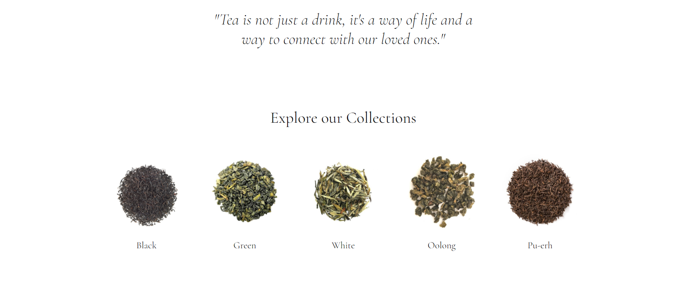
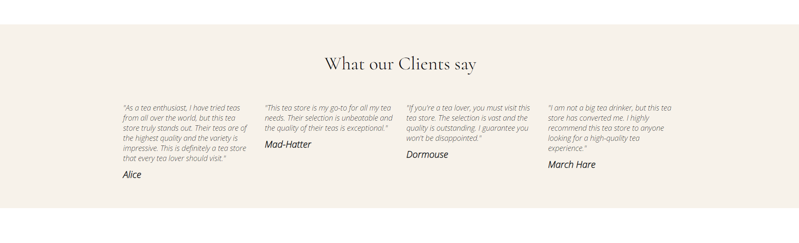
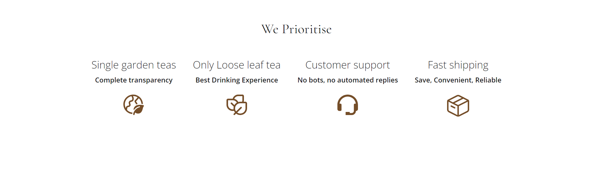
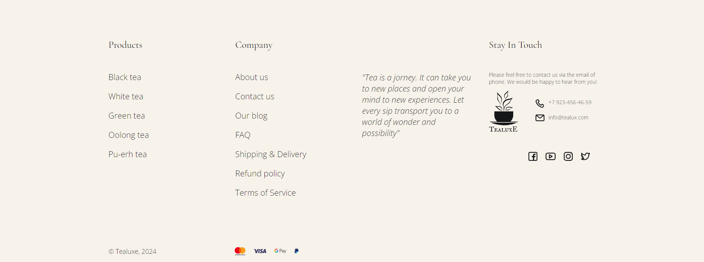

### Здесь сверстана первая страница интернет магазина по продаже чая

### Ссылка на GitHub Pages: https://elboyko.github.io/TeaSite/

---

##### Используемые инструменты:

1. Html разметка
2. стили CSS
3. простая логика JS

---

**Что для меня было новым**: интересное меню для мобильной версии с дополнительными пунктами списка

---

